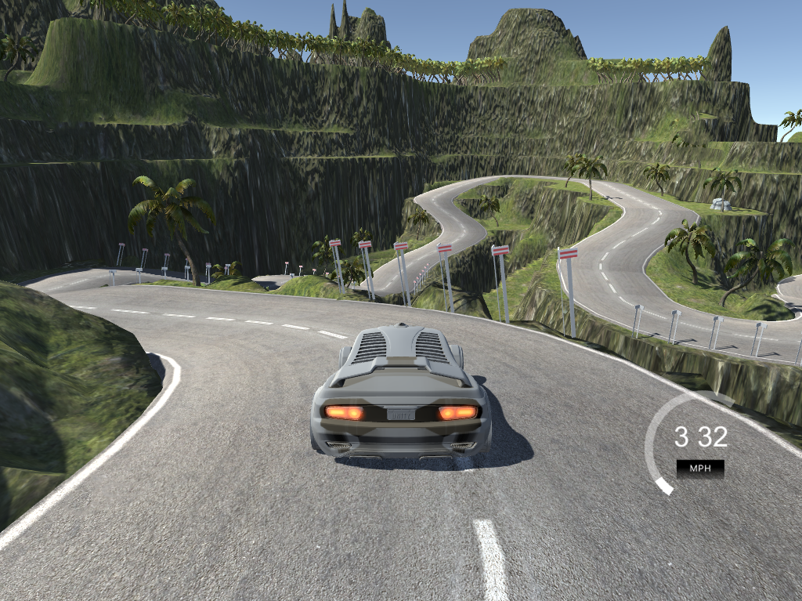

# End-to-End Self-Driving Car System Based on Deep Learning



## Project Overview

This project implements an end-to-end autonomous driving system using deep learning techniques. The system uses convolutional neural networks (CNNs) to learn steering angles directly from camera images, following the behavioral cloning approach. The model is trained on data collected from a driving simulator and can autonomously navigate both lake and mountain tracks.

### Key Features
- End-to-end learning from raw pixels to steering commands
- Multiple CNN architectures (3 different models available)
- Real-time autonomous driving via socket communication
- Data augmentation techniques (flipping, translation, camera angle selection)
- Support for multiple track environments

---

## Project Structure
```
Selfdriving/
├── build_model.py              # CNN model architectures
├── preprocessing.py            # Image preprocessing and augmentation
├── train_model.py             # Model training script
├── driving.py                 # Autonomous driving controller
├── test_file.py               # Dependency verification
├── requirements.txt           # Python dependencies
├── data_lake/                 # Example training data (lake track)
│   ├── driving_log.csv        # Steering angles and image paths
│   └── IMG/                   # Camera images
├── data_mountain/             # Example training data (mountain track)
│   ├── driving_log.csv
│   └── IMG/
├── test/                      # Sample test images
│   ├── center.jpg
│   ├── left.jpg
│   └── right.jpg
├── Yexianglun_lake_model2.h5      # Pre-trained model (lake track)
├── Yexianglun_mountain_model2.h5  # Pre-trained model (mountain track)
└── *.h5 files                 # Model checkpoints from training
```

### File Descriptions

#### Core Scripts

**`build_model.py`**
- Contains three different CNN architectures:
  - `build_model1()`: Lightweight model with MaxPooling layers
  - `build_model2()`: NVIDIA-inspired architecture (recommended)
  - `build_model3()`: Deeper VGG-style architecture
- All models use ELU/ReLU activation and dropout for regularization

**`preprocessing.py`**
- Image preprocessing functions:
  - `image_choose()`: Randomly selects center/left/right camera with steering correction
  - `image_flip()`: Horizontal flipping for data augmentation
  - `image_translate()`: Random translation for robustness
  - `image_normalized()`: Crops, resizes (200×66), and converts to YUV color space
  - `image_preprocessing()`: Combines all augmentation techniques

**`train_model.py`**
- Main training script with:
  - Data loading and train/test split
  - Batch generator for memory-efficient training
  - Model compilation with Adam optimizer and MSE loss
  - Callbacks: ModelCheckpoint, EarlyStopping, TensorBoard
  - Configurable hyperparameters (epochs, batch size, etc.)

**`driving.py`**
- Real-time autonomous driving controller:
  - Establishes socket connection with simulator (port 4567)
  - Receives telemetry data (images, speed)
  - Predicts steering angle using trained model
  - Calculates throttle based on speed and steering angle
  - Sends control commands back to simulator

---

## Installation and Setup

### Prerequisites
- Python 3.7 or higher
- CUDA-capable GPU (recommended for training)

### Step 1: Clone the Repository
```bash
git clone https://github.com/Nasihat-7/End-to-End-Vision-Based-Autonomous-Driving-Using-Deep-Learning.git
cd Selfdriving
```

### Step 2: Install Dependencies
```bash
pip install -r requirements.txt
```

**Required packages:**
- tensorflow (with Keras)
- opencv-python
- numpy
- pandas
- scikit-learn
- flask
- python-socketio
- eventlet
- pillow

### Step 3: Download the Simulator

1. Download the Udacity Self-Driving Car Simulator:
   - Windows: [Download Link](https://github.com/udacity/self-driving-car-sim)
   - macOS/Linux: Available from the same repository

2. Extract the simulator to a folder (e.g., `wurenjiashi/beta_simulator_windows/`)

3. The simulator has two modes:
   - **Training Mode**: For collecting training data
   - **Autonomous Mode**: For testing your trained model

---

## Usage Guide

### Phase 1: Collect Training Data

#### Step 1: Launch Simulator in Training Mode
1. Run `beta_simulator.exe`
2. Select screen resolution and graphics quality
3. Click **"TRAINING MODE"**
4. Choose a track (Lake Track or Mountain Track)

#### Step 2: Record Driving Data
1. Click **"RECORD"** button
2. Select a folder to save data (e.g., create `data_my_track/`)
3. Drive the car using:
   - **Arrow keys** or **WASD** for steering and throttle
   - Try to stay centered in the lane
   - Include recovery scenarios (from sides back to center)
   - Complete at least 2-3 laps for good coverage

4. Click **"RECORD"** again to stop recording

#### Step 3: Verify Data Structure
After recording, your folder should contain:
```
data_my_track/
├── driving_log.csv          # CSV with columns: center, left, right, steering, throttle, brake, speed
└── IMG/
    ├── center_YYYY_MM_DD_HH_MM_SS_XXX.jpg  # Center camera images
    ├── left_YYYY_MM_DD_HH_MM_SS_XXX.jpg    # Left camera images
    └── right_YYYY_MM_DD_HH_MM_SS_XXX.jpg   # Right camera images
```

**Expected data format:**
- `driving_log.csv`: Each row contains image paths and corresponding steering angle
- `IMG/`: Contains thousands of images (typically 5,000-15,000 per track)
- Images are 320×160 RGB format

**Tips for good training data:**
- Drive smoothly and consistently
- Record both clockwise and counter-clockwise laps
- Include gentle curves and sharp turns
- Practice recovery maneuvers from lane edges
- Aim for at least 10,000 images per track

---

### Phase 2: Train the Model

#### Step 1: Configure Training Parameters
Edit `train_model.py` to set your data path and hyperparameters:
```python
# In train_model.py, modify these variables:
data_path = 'data_my_track/'  # Your training data folder
test_ration = 0.1             # 10% for validation
batch_size = 100              # Images per batch
batch_num = 200               # Batches per epoch
epoch = 300                   # Maximum epochs (early stopping applies)
```

#### Step 2: Select Model Architecture
Choose one of the three models in `train_model.py`:
```python
# Line 61, choose your model:
model = build_model1()  # Lightweight (faster, less accurate)
model = build_model2()  # NVIDIA-style (recommended, balanced)
model = build_model3()  # Deeper VGG-style (slower, potentially better)
```

#### Step 3: Run Training
```bash
python train_model.py
```

**Training process:**
1. Data is loaded and split (90% train, 10% validation)
2. Model trains with data augmentation
3. Best models are saved as `Yexianglun_mountain_model2_XXX.h5` (or your custom name)
4. Training stops early if validation loss doesn't improve for 500 epochs
5. TensorBoard logs are saved to `./logs/`

**Expected output:**
- Console shows epoch progress, loss, and accuracy
- Model checkpoints saved every epoch (if validation improves)
- Final model saved as `Yexianglun_mountain_model2.h5`

**Training tips:**
- Training time: 2-4 hours on GPU, 10-20 hours on CPU
- Monitor validation loss - it should decrease steadily
- If loss plateaus early, collect more diverse training data
- Use TensorBoard to visualize training: `tensorboard --logdir=./logs`

#### Step 4: Verify Trained Model
After training, you should have:
```
Yexianglun_mountain_model2.h5           # Final model
Yexianglun_mountain_model2_001.h5       # Checkpoint from epoch 1
Yexianglun_mountain_model2_XXX.h5       # Best checkpoints
logs/                                   # TensorBoard logs
```

**Model file characteristics:**
- File size: typically 5-50 MB depending on architecture
- Contains trained weights and architecture
- Can be loaded with `keras.models.load_model()`

---

### Phase 3: Autonomous Driving

#### Step 1: Configure Driving Script
Edit `driving.py` to specify your trained model:
```python
# Line 19 in driving.py:
model = load_model('Yexianglun_mountain_model2.h5')  # Use your model file
```

Optional adjustments:
```python
max_speed = 20      # Maximum speed (increase for faster driving)
throttle = 0.3      # Base throttle value
```

#### Step 2: Start Driving Server
```bash
python driving.py
```

**Expected output:**
```
Server listening on port 4567
Waiting for simulator connection...
```

#### Step 3: Launch Simulator in Autonomous Mode
1. Run `beta_simulator.exe`
2. Select **"AUTONOMOUS MODE"**
3. Choose the same track you trained on
4. The car should start driving automatically

**Console output:**
```
与模拟器连接成功 (Connected to simulator successfully)
{'steering_angle': '0', 'throttle': '0', 'speed': '0', 'image': '...'}
Speed: 15.34
Steering angle: -0.0234
...
```

#### Step 4: Monitor Performance
- **Image window** shows what the car sees in real-time
- **Console** displays steering angles and speed
- The car should navigate the track autonomously

**Troubleshooting:**
- If car drives off track: Retrain with more data or adjust steering correction
- If car is too slow: Increase `max_speed` in `driving.py`
- If car oscillates: Model may be overfitting; try more regularization
- If connection fails: Check that port 4567 is not blocked

---

## Model Architecture Details

### Model 2 (NVIDIA-inspired - Recommended)
```
Input: 200×66×3 (YUV color space)
├── Normalization layer (x/127.5 - 1)
├── Conv2D(24, 5×5, stride 2×2, ELU)
├── Conv2D(36, 5×5, stride 2×2, ELU)
├── Conv2D(48, 5×5, stride 2×2, ELU)
├── Conv2D(64, 3×3, stride 1×1, ELU)
├── Conv2D(64, 3×3, stride 1×1, ELU)
├── Dropout(0.5)
├── Flatten
├── Dense(100, ELU)
├── Dense(50, ELU)
├── Dense(10, ELU)
└── Dense(1) → Steering angle output
```

**Total parameters:** ~250,000

---

## Data Augmentation Strategy

The preprocessing pipeline applies several techniques to improve generalization:

1. **Camera Selection**: Randomly chooses center/left/right camera
   - Left camera: +0.2 steering correction
   - Right camera: -0.2 steering correction

2. **Horizontal Flipping**: 50% chance to mirror image and negate steering

3. **Random Translation**: 
   - Horizontal: ±100 pixels (with steering correction)
   - Vertical: ±10 pixels

4. **Cropping**: Removes sky (top 60px) and hood (bottom 25px)

5. **Resizing**: 200×66 pixels (NVIDIA architecture standard)

6. **Color Space**: RGB → YUV conversion

---

## Tips for Success

### For Better Training Data:
- Drive at consistent speed (15-25 mph)
- Stay centered in lane most of the time
- Include smooth steering transitions
- Record recovery scenarios separately
- Avoid sudden jerky movements

### For Better Model Performance:
- Use at least 10,000 training images
- Balance left/right turns in dataset
- Train for sufficient epochs (100-300)
- Monitor validation loss for overfitting
- Experiment with different models

### For Smooth Autonomous Driving:
- Start with lower speeds (max_speed = 15-20)
- Fine-tune throttle calculation if needed
- Test on the same track you trained on first
- Gradually increase difficulty (lake → mountain)

---

## Troubleshooting Common Issues

| Issue | Possible Cause | Solution |
|-------|---------------|----------|
| Car oscillates | Overfitting or insufficient data | Collect more data, increase dropout |
| Car drives off track | Poor steering predictions | Retrain with better quality data |
| Training loss not decreasing | Learning rate too high/low | Adjust Adam learning_rate |
| Connection error | Port blocked or simulator not running | Check port 4567, restart simulator |
| Out of memory during training | Batch size too large | Reduce batch_size in train_model.py |

---

## Advanced Usage

### Using TensorBoard
Monitor training progress in real-time:
```bash
tensorboard --logdir=./logs
# Open http://localhost:6006 in browser
```

### Transfer Learning
Fine-tune a pre-trained model on new data:
```python
# In train_model.py:
from tensorflow.keras.models import load_model
model = load_model('Yexianglun_lake_model2.h5')
# Continue training with new data_path
```

### Testing Preprocessing
Visualize preprocessing effects:
```bash
python preprocessing.py
```

---


---

## License

This project is licensed under the MIT License - see the [LICENSE](LICENSE) file for details.

---

## References

- [NVIDIA End-to-End Deep Learning for Self-Driving Cars](https://arxiv.org/abs/1604.07316)
- [Udacity Self-Driving Car Simulator](https://github.com/udacity/self-driving-car-sim)
- [Behavioral Cloning Project](https://github.com/udacity/CarND-Behavioral-Cloning-P3)

---

## Contact

For questions or issues, please open an issue on GitHub or contact the repository owner.

**GitHub:** [Nasihat-7/Selfdriving](https://github.com/Nasihat-7/Selfdriving)

---

## Acknowledgments

Special thanks to Udacity for providing the simulator and inspiration for this educational project.
